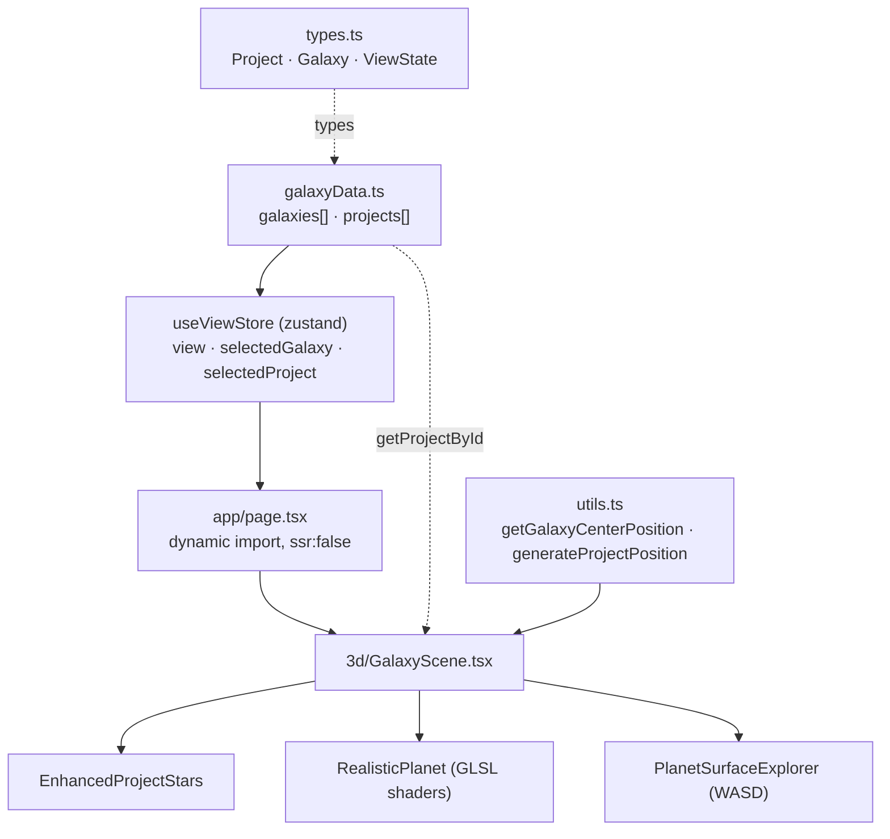

# Data Flow

Single source of truth is `src/lib/galaxyData.ts` (the `galaxies` array of
projects). State flows through the view store into the lazy-loaded 3D scene,
which renders each project as a star/planet.

Key files: `src/app/page.tsx:32` (lazy `GalaxyScene`),
`src/components/3d/GalaxyScene.tsx:43-45` (imports galaxyData + store + utils).
Galaxy count / project count live in `galaxyData.ts`; do not duplicate the
numbers elsewhere.
