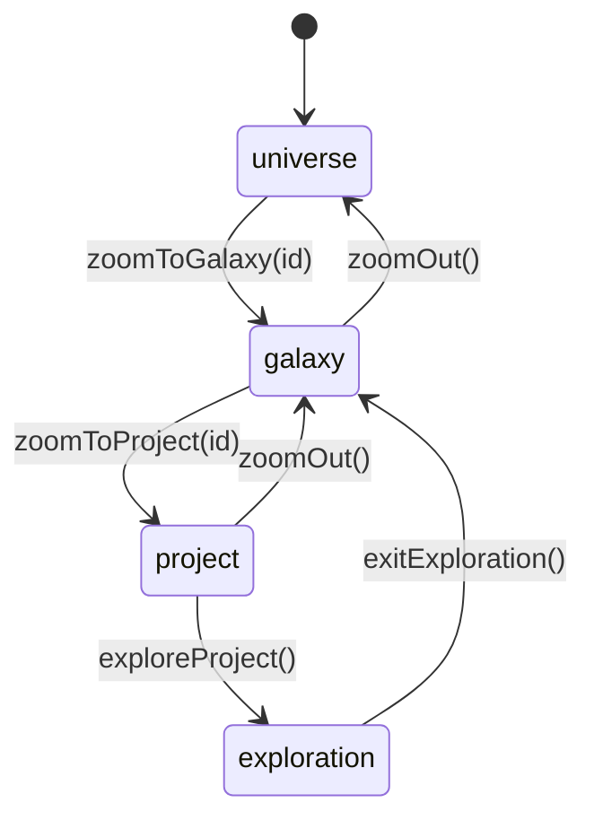

# View State Machine

The 3D galaxy is driven by a single Zustand view store. `ViewState`
(`src/lib/types.ts:69`) has four states; `useViewStore` (`src/lib/store.ts:76`)
holds `view`, `selectedGalaxy`, and `selectedProject`, and exposes the
transition actions below.

Transition actions (all in `src/lib/store.ts`):

| Action | From → To | Line |
|---|---|---|
| `zoomToGalaxy(id)` | universe → galaxy | 117 |
| `zoomToProject(id)` | galaxy → project | 134 |
| `exploreProject()` | project → exploration | 154 |
| `exitExploration()` | exploration → galaxy/universe | 169 |
| `zoomOut()` | generic back-nav | 179 |

Related stores: `useHoverGravityStore` (289), `useCanvasPerformanceStore`
(314, adaptive DPR tiers), `useMotionStore` (329, reduced-motion).
