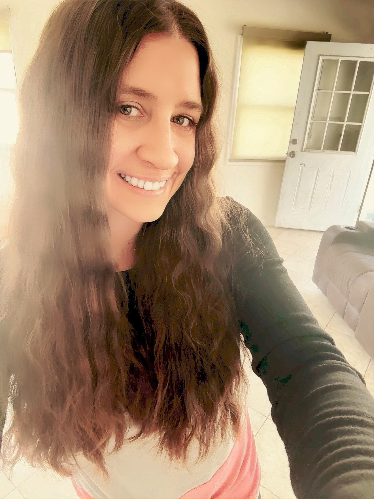

# elizabethannstein.com

> Interactive 3D galaxy portfolio — projects orbit as planets across 6 themed galaxies you can fly through. Built with Next.js 16, React Three Fiber, GSAP, and Theatre.js. Live at [elizabethannstein.com](https://elizabethannstein.com).



[](https://github.com/forbiddenlink/elizabethannstein/actions/workflows/ci.yml)
[](https://github.com/forbiddenlink/elizabethannstein/actions/workflows/lighthouse.yml)
[](https://elizabethannstein.com)
[](LICENSE)

## What it does

A personal portfolio that treats projects as celestial bodies. Visitors land in a 3D scene rendered via WebGL/WebGPU, pick a galaxy, and warp to project planets with cinematic camera moves. Each planet links to a `/work/[slug]` case study page. The full surface includes a homepage galaxy view, `/work` index + slug pages, `/about`, `/contact` (Resend-backed), `/privacy`, and `/health`.

Beyond the 3D layer it ships a Galaxy Guide AI (MiniMax) for visitors, an Arcjet-protected contact API, full Playwright E2E coverage across 7 browser profiles, visual regression snapshots, weekly Claude-driven maintenance, Lighthouse CI, and Sentry telemetry. The codebase is a working showcase of advanced R3F patterns (post-processing, physics, particles, custom shaders, WebGPU) for hiring conversations.

## Stack

| Layer | Tech |
|-------|------|
| Framework | Next.js 16.2 (App Router, `src/` layout, `proxy.ts` middleware), React 19.2 |
| Language | TypeScript 5.9 strict |
| Styling | Tailwind CSS v4 |
| 3D / WebGL | three.js 0.182, React Three Fiber 9, @react-three/drei, @react-three/postprocessing, @react-three/rapier (physics), @react-three/a11y, three.quarks (particles), postprocessing 6, WebGPU canvas |
| Animation | GSAP 3.14 + @gsap/react, Framer Motion 12, Theatre.js (`@theatre/core`, `@theatre/r3f`) |
| State | Zustand 5, nuqs (URL state) |
| Server | Next.js Server Actions + `next-safe-action` |
| Email | Resend (contact form) |
| AI | MiniMax (Galaxy Guide assistant — server-only key) |
| Abuse protection | Arcjet (`/api/*`) |
| Observability | Sentry, Vercel Analytics, Speed Insights, next-axiom |
| Testing | Vitest, Playwright (smoke, visual, 5 browser projects + mobile) |
| Tooling | Biome, lefthook, knip, lighthouse CI, r3f-perf, stats-gl, Leva (dev controls) |
| Hosting | Vercel |

## Architecture

```mermaid
flowchart LR
  V[Visitor] --> N[Next.js App Router]
  N -->|RSC pages| W[/work, /about, /contact, /]
  W -->|hydrate| CV[WebGPU/WebGL Canvas]
  CV --> RF[React Three Fiber Scene]
  RF --> G[GalaxyScene · Planets · Camera]
  RF --> PP[PostProcessing FX]
  RF --> PH[Rapier Physics]
  RF --> TH[Theatre.js cinematics]
  N -->|Server Action| CT[/api/contact → Resend]
  N -->|Server Action| AI[/api/galaxy-guide → MiniMax]
  CT -.->|guard| AJ[Arcjet]
  AI -.->|guard| AJ
  N --> S[Sentry · Vercel Analytics · Axiom]
```

3D scene components live in `src/components/3d/` (~40 components covering galaxies, planets, post-processing, particles, physics, cinematic camera).

## Quickstart

```bash
git clone git@github.com:forbiddenlink/elizabethannstein.git
cd elizabethannstein
pnpm install
cp .env.example .env.local       # all vars are optional for local dev
pnpm dev                          # http://localhost:3000
```

Hardware: WebGL2-capable GPU. WebGPU canvas auto-detects support and falls back to WebGL.

## Environment variables

| Variable | Required? | What it's for |
|----------|-----------|---------------|
| `NEXT_PUBLIC_SITE_URL` | Prod | Canonical URL for sitemap, OG metadata |
| `NEXT_PUBLIC_GA_ID` | Optional | Google Analytics |
| `NEXT_PUBLIC_SENTRY_DSN` | Optional | Client error reporting |
| `MINMAX_API_KEY` | Optional | Server-only — Galaxy Guide AI |
| `RESEND_API_KEY` | Optional | Contact form delivery |
| `CONTACT_FORWARD_TO` | Optional | Override contact form recipient |
| `ARCJET_KEY` | Recommended (prod) | Abuse protection on `/api/*` |
| `PLAYWRIGHT_PORT`, `BASE_URL` | Local E2E | Defaults to `:3100` |
| `ANALYZE` | Optional | `true` runs `@next/bundle-analyzer` |

See `.env.example` for inline notes.

## Common commands

```bash
pnpm dev                       # next dev --webpack
pnpm build                     # production build
pnpm test                      # vitest
pnpm test:e2e                  # playwright (all projects)
pnpm test:e2e:smoke            # smoke project only
pnpm test:e2e:ci               # 7-project matrix (incl. mobile-chrome/safari)
pnpm test:e2e:visual           # visual regression snapshots
pnpm analyze                   # ANALYZE=true next build
pnpm screenshots               # capture project thumbnails via scripts/capture-screenshots.ts
pnpm biome:check               # lint + format
```

CI runs the smoke + visual + cross-browser matrix on every PR; weekly Claude PR review + maintenance workflows are wired in `.github/workflows/`.

## Project structure

```
src/
├── app/                 # Routes: /, /about, /contact, /work, /work/[slug], /api/*
├── components/
│   ├── 3d/              # ~40 R3F components (galaxies, planets, FX, physics, cinematics)
│   ├── projects/        # Project cards, case study UI
│   ├── work/            # /work index UI
│   └── ui/              # Shared primitives
├── hooks/, lib/, mocks/, __tests__/
└── proxy.ts             # Next.js 16 middleware (was middleware.ts)
public/
├── images/              # Project thumbnails (.webp)
├── screenshots/         # Captured site screenshots
├── testimonials/
└── resume.pdf
```

## Roadmap

- [ ] Additional case studies under `/work/[slug]`
- [ ] WebGPU-only "performance mode" toggle
- [ ] Audio-reactive cinematic sequences via Theatre.js
- [x] Full Playwright 7-browser CI matrix
- [x] WebGPU canvas with WebGL fallback
- [x] Lighthouse CI workflow

## License

MIT — see [LICENSE](LICENSE).
